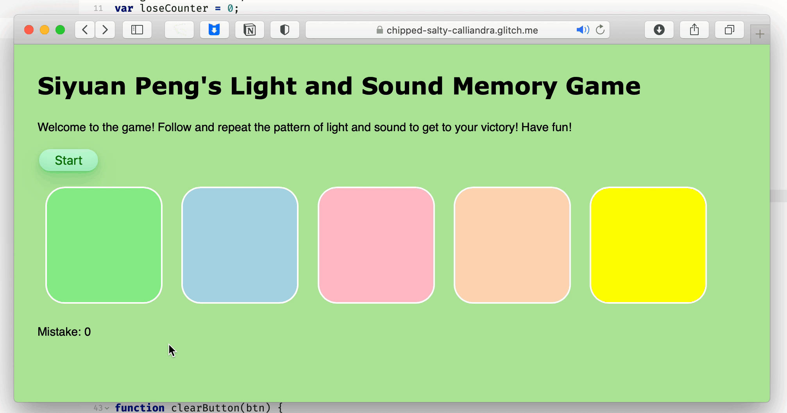
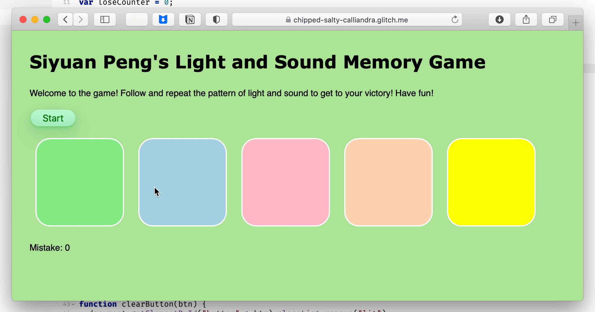

# Pre-work - *Memory Game*

**Memory Game** is a Light & Sound Memory game to apply for CodePath's SITE Program.

Submitted by: **Siyuan Peng**

Time spent: **5** hours spent in total

Link to project: https://glitch.com/edit/#!/siyuanpeng-codepath-prework

## Required Functionality

The following **required** functionality is complete:

* [x] Game interface has a heading (h1 tag), a line of body text (p tag), and four buttons that match the demo app
* [x] "Start" button toggles between "Start" and "Stop" when clicked. 
* [x] Game buttons each light up and play a sound when clicked. 
* [x] Computer plays back sequence of clues including sound and visual cue for each button
* [x] Play progresses to the next turn (the user gets the next step in the pattern) after a correct guess. 
* [x] User wins the game after guessing a complete pattern
* [x] User loses the game after an incorrect guess

The following **optional** features are implemented:

* [x] Any HTML page elements (including game buttons) has been styled differently than in the tutorial
* [x] Buttons use a pitch (frequency) other than the ones in the tutorial
* [x] More than 4 functional game buttons
* [ ] Playback speeds up on each turn
* [ ] Computer picks a different pattern each time the game is played
* [x] Player only loses after 3 mistakes (instead of on the first mistake)
* [x] Game button appearance change goes beyond color (e.g. add an image)
* [ ] Game button sound is more complex than a single tone (e.g. an audio file, a chord, a sequence of multiple tones)
* [ ] User has a limited amount of time to enter their guess on each turn

The following **additional** features are implemented:

- [x] List anything else that you can get done to improve the app!
- [x] Count the number of mistakes user has made, and return to 0 when game is restarted 

## Video Walkthrough (GIF)

If you recorded multiple GIFs for all the implemented features, you can add them here:
1. The first gif file shows the full process of my game from start to win. As you can see that, HTML elements have been modified including title's fontsize, color, background color, start and stop button's style (shape, color, shadow, boarder), and game button's style (shape, color, shadow, boarder). There is also a paragraph below gamebuttons that indicates the number of mistakes. An additional gamebutton has also been added. Moreover, gamebutton appearance has been changed. When the user presses the button or program "presses", gamebutton will be larger. When the user finishes all the pattern, win message shows up. Pitches of each gamebutton have been changed, reflected in sound and code (not in gif).

2. The second gif shows the mistake counter and how game is stopped when the number of mistakes is greater than 3. When user makes mistake, the mistake counter increases and updates the text below gamebuttons. When user makes three mistakes, the game is over and lost message pops up. When the users presses stop and start again, the counter returns to 0, as shown in the gif.

3. This gif verifies that the game is restarted to initial state when user presses stop and start at any time. As we can see, the game starts again from the first button when user presses stop and start button during the game. 

## Reflection Questions
1. If you used any outside resources to help complete your submission (websites, books, people, etc) list them here. 
* For my Start and Stop button, I modified and used the style of "Button 33" from https://getcssscan.com/css-buttons-examples.
* For updating the number of mistake information, I searched about updating HTML paragraph text and learnt from https://www.tutorialkart.com/javascript/how-to-change-text-in-paragraph-using-javascript/.
* For changing the pitch sounds to "Do-Re-Mi", I referred to the frequency value here: https://www.howmusicreallyworks.com/Pages_Chapter_4/4_1.html.
* For using more choices of color supported by CSS, I referred to https://www.w3.org/wiki/CSS/Properties/color/keywords.

2. What was a challenge you encountered in creating this submission (be specific)? How did you overcome it? (recommended 200 - 400 words) 
 [YOUR ANSWER HERE]

3. What questions about web development do you have after completing your submission? (recommended 100 - 300 words) 
[YOUR ANSWER HERE]

4. If you had a few more hours to work on this project, what would you spend them doing (for example: refactoring certain functions, adding additional features, etc). Be specific. (recommended 100 - 300 words) 
 [YOUR ANSWER HERE]

## Interview Recording URL Link

[My 5-minute Interview Recording](your-link-here)

## License

    Copyright Siyuan Peng

    Licensed under the Apache License, Version 2.0 (the "License");
    you may not use this file except in compliance with the License.
    You may obtain a copy of the License at

        http://www.apache.org/licenses/LICENSE-2.0

    Unless required by applicable law or agreed to in writing, software
    distributed under the License is distributed on an "AS IS" BASIS,
    WITHOUT WARRANTIES OR CONDITIONS OF ANY KIND, either express or implied.
    See the License for the specific language governing permissions and
    limitations under the License.